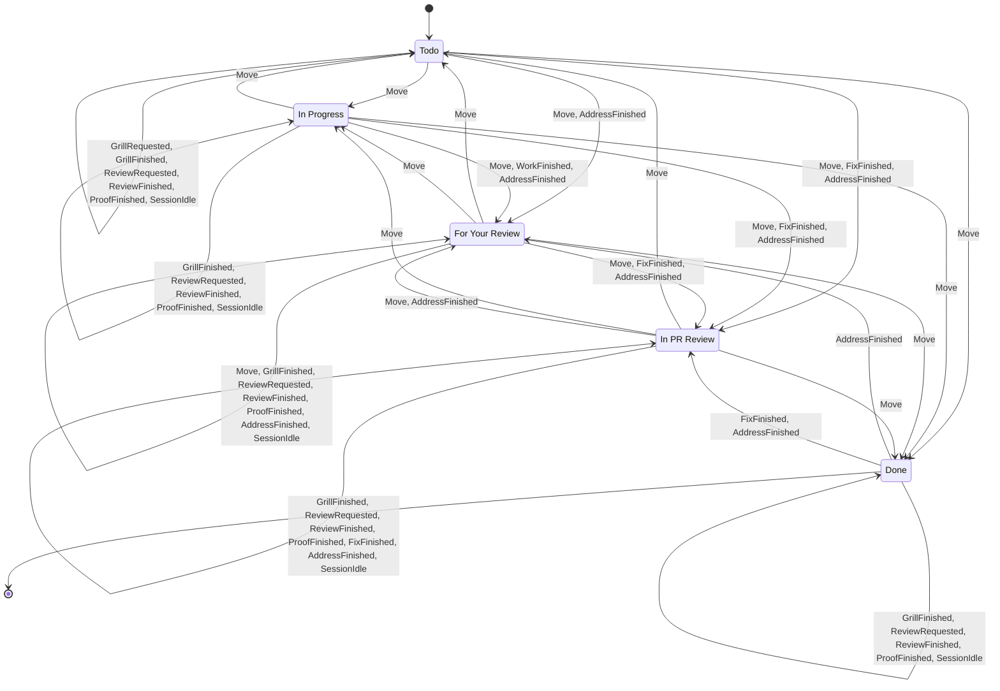

# Ticket lifecycle state machine

<!-- GENERATED FILE — do not edit by hand.
     Regenerate with `task flow:doc` (or `UPDATE_FLOW_DOC=1 cargo test -p harmony-core --test flow_doc`).
     Source of truth: `core/src/flow.rs` (`decide`); rendered by `core/src/flow_doc.rs`. -->

This document is generated directly from `flow::decide`, so it always matches the code. `HumanReview` is the "For Your Review" (pre-PR sanity check) column; `Pr` is "In PR Review" (awaiting external GitHub approval).

## Diagram

## Transitions

Every distinct outcome of `decide`, grouped by the column the ticket is in. *Guard* is the condition over the relevant `Ctx` facts (`!` = false); *(any)* means the outcome is unconditional. *Blocked* outcomes leave the ticket where it is and run no actions.

### From Todo

| Event | Guard | → Target | Actions | Blocked |
|-------|-------|----------|---------|----------|
| Move → Todo | (any) | Todo | — |  |
| Move → In Progress | !has_repo | Todo | — | assign a repo first |
| Move → In Progress | has_repo & !has_spec & !drafting | In Progress | StartGrill |  |
| Move → In Progress | has_repo & has_spec & !drafting & !planned | In Progress | EnsureWorktree, StartImplement |  |
| Move → In Progress | has_repo & drafting | Todo | — | finish the interview first |
| Move → In Progress | has_repo & has_spec & !drafting & planned | In Progress | ResumeWork |  |
| Move → For Your Review | !has_repo | Todo | — | assign a repo first |
| Move → For Your Review | has_repo & !session_live & !has_changes OR has_repo & !session_live & review_current | For Your Review | — |  |
| Move → For Your Review | has_repo & session_live & !has_changes OR has_repo & session_live & review_current | For Your Review | StopSession |  |
| Move → For Your Review | has_repo & !session_live & has_changes & !review_current | For Your Review | RunReview |  |
| Move → For Your Review | has_repo & session_live & has_changes & !review_current | For Your Review | StopSession, RunReview |  |
| Move → In PR Review | !has_repo | Todo | — | assign a repo first |
| Move → In PR Review | has_repo & !has_changes | Todo | — | no changes to open a PR for |
| Move → In PR Review | has_repo & !session_live & has_changes & !review_current & !reviewed | For Your Review | RunReview |  |
| Move → In PR Review | has_repo & session_live & has_changes & !review_current & !reviewed | For Your Review | StopSession, RunReview |  |
| Move → In PR Review | has_repo & !session_live & has_changes & review_current & !reviewed | For Your Review | — |  |
| Move → In PR Review | has_repo & session_live & has_changes & review_current & !reviewed | For Your Review | StopSession |  |
| Move → In PR Review | has_repo & !session_live & has_changes & reviewed & !pr_exists | In PR Review | OpenPr |  |
| Move → In PR Review | has_repo & session_live & has_changes & reviewed & !pr_exists | In PR Review | StopSession, OpenPr |  |
| Move → In PR Review | has_repo & !session_live & has_changes & reviewed & pr_exists | In PR Review | — |  |
| Move → In PR Review | has_repo & session_live & has_changes & reviewed & pr_exists | In PR Review | StopSession |  |
| Move → Done | !session_live & !has_worktree & !pr_approved OR !session_live & !has_worktree & !pr_exists | Done | — |  |
| Move → Done | session_live & !has_worktree & !pr_approved OR session_live & !has_worktree & !pr_exists | Done | StopSession |  |
| Move → Done | !session_live & has_worktree & !pr_approved OR !session_live & has_worktree & !pr_exists | Done | DeleteWorktree |  |
| Move → Done | session_live & has_worktree & !pr_approved OR session_live & has_worktree & !pr_exists | Done | StopSession, DeleteWorktree |  |
| Move → Done | !session_live & !has_worktree & pr_exists & pr_approved | Done | MergePr |  |
| Move → Done | session_live & !has_worktree & pr_exists & pr_approved | Done | StopSession, MergePr |  |
| Move → Done | !session_live & has_worktree & pr_exists & pr_approved | Done | MergePr, DeleteWorktree |  |
| Move → Done | session_live & has_worktree & pr_exists & pr_approved | Done | StopSession, MergePr, DeleteWorktree |  |
| GrillRequested | !has_repo | Todo | — | assign a repo first |
| GrillRequested | has_repo & !drafting | Todo | StartGrill |  |
| GrillRequested | has_repo & drafting | Todo | — | already drafting a spec |
| GrillFinished | (any) | Todo | StopSession |  |
| WorkFinished | (any) | Todo | — |  |
| ReviewRequested | !has_repo | Todo | — | assign a repo first |
| ReviewRequested | has_repo & !has_changes | Todo | — | no changes to review |
| ReviewRequested | has_repo & !session_live & has_changes | Todo | RunReview |  |
| ReviewRequested | has_repo & session_live & has_changes | Todo | StopSession, RunReview |  |
| ReviewFinished | (any) | Todo | StopSession, MarkReviewed |  |
| ProofFinished | (any) | Todo | StopSession, MarkProofDone |  |
| FixFinished | (any) | In PR Review | CommitChanges, PushBranch |  |
| AddressFinished | !pr_exists | For Your Review | CommitChanges |  |
| AddressFinished | pr_exists | In PR Review | CommitChanges, PushBranch |  |
| SessionIdle | !auto_end_idle OR user_question_pending | Todo | — |  |
| SessionIdle | !user_question_pending & auto_end_idle | Todo | StopSession |  |

### From In Progress

| Event | Guard | → Target | Actions | Blocked |
|-------|-------|----------|---------|----------|
| Move → Todo | !session_live | Todo | — |  |
| Move → Todo | session_live | Todo | StopSession |  |
| Move → In Progress | (any) | In Progress | — |  |
| Move → For Your Review | !has_repo | In Progress | — | assign a repo first |
| Move → For Your Review | has_repo & !session_live & !has_changes OR has_repo & !session_live & review_current | For Your Review | — |  |
| Move → For Your Review | has_repo & session_live & !has_changes OR has_repo & session_live & review_current | For Your Review | StopSession |  |
| Move → For Your Review | has_repo & !session_live & has_changes & !review_current | For Your Review | RunReview |  |
| Move → For Your Review | has_repo & session_live & has_changes & !review_current | For Your Review | StopSession, RunReview |  |
| Move → In PR Review | !has_repo | In Progress | — | assign a repo first |
| Move → In PR Review | has_repo & !has_changes | In Progress | — | no changes to open a PR for |
| Move → In PR Review | has_repo & !session_live & has_changes & !review_current & !reviewed | For Your Review | RunReview |  |
| Move → In PR Review | has_repo & session_live & has_changes & !review_current & !reviewed | For Your Review | StopSession, RunReview |  |
| Move → In PR Review | has_repo & !session_live & has_changes & review_current & !reviewed | For Your Review | — |  |
| Move → In PR Review | has_repo & session_live & has_changes & review_current & !reviewed | For Your Review | StopSession |  |
| Move → In PR Review | has_repo & !session_live & has_changes & reviewed & !pr_exists | In PR Review | OpenPr |  |
| Move → In PR Review | has_repo & session_live & has_changes & reviewed & !pr_exists | In PR Review | StopSession, OpenPr |  |
| Move → In PR Review | has_repo & !session_live & has_changes & reviewed & pr_exists | In PR Review | — |  |
| Move → In PR Review | has_repo & session_live & has_changes & reviewed & pr_exists | In PR Review | StopSession |  |
| Move → Done | !session_live & !has_worktree & !pr_approved OR !session_live & !has_worktree & !pr_exists | Done | — |  |
| Move → Done | session_live & !has_worktree & !pr_approved OR session_live & !has_worktree & !pr_exists | Done | StopSession |  |
| Move → Done | !session_live & has_worktree & !pr_approved OR !session_live & has_worktree & !pr_exists | Done | DeleteWorktree |  |
| Move → Done | session_live & has_worktree & !pr_approved OR session_live & has_worktree & !pr_exists | Done | StopSession, DeleteWorktree |  |
| Move → Done | !session_live & !has_worktree & pr_exists & pr_approved | Done | MergePr |  |
| Move → Done | session_live & !has_worktree & pr_exists & pr_approved | Done | StopSession, MergePr |  |
| Move → Done | !session_live & has_worktree & pr_exists & pr_approved | Done | MergePr, DeleteWorktree |  |
| Move → Done | session_live & has_worktree & pr_exists & pr_approved | Done | StopSession, MergePr, DeleteWorktree |  |
| GrillRequested | (any) | In Progress | — | grill is only available in Todo |
| GrillFinished | (any) | In Progress | StopSession, EnsureWorktree, StartImplement |  |
| WorkFinished | !has_changes & !user_question_pending OR review_current & !user_question_pending | For Your Review | CommitChanges, StopSession |  |
| WorkFinished | has_changes & !review_current & !user_question_pending | For Your Review | CommitChanges, StopSession, RunReview |  |
| WorkFinished | user_question_pending | In Progress | — |  |
| ReviewRequested | !has_repo | In Progress | — | assign a repo first |
| ReviewRequested | has_repo & !has_changes | In Progress | — | no changes to review |
| ReviewRequested | has_repo & !session_live & has_changes | In Progress | RunReview |  |
| ReviewRequested | has_repo & session_live & has_changes | In Progress | StopSession, RunReview |  |
| ReviewFinished | (any) | In Progress | StopSession, MarkReviewed |  |
| ProofFinished | (any) | In Progress | StopSession, MarkProofDone |  |
| FixFinished | (any) | In PR Review | CommitChanges, PushBranch |  |
| AddressFinished | !pr_exists | For Your Review | CommitChanges |  |
| AddressFinished | pr_exists | In PR Review | CommitChanges, PushBranch |  |
| SessionIdle | !auto_end_idle OR user_question_pending | In Progress | — |  |
| SessionIdle | !user_question_pending & auto_end_idle | In Progress | StopSession |  |

### From For Your Review

| Event | Guard | → Target | Actions | Blocked |
|-------|-------|----------|---------|----------|
| Move → Todo | !session_live | Todo | — |  |
| Move → Todo | session_live | Todo | StopSession |  |
| Move → In Progress | !has_repo | For Your Review | — | assign a repo first |
| Move → In Progress | has_repo & !has_spec & !drafting | In Progress | StartGrill |  |
| Move → In Progress | has_repo & has_spec & !drafting & !planned | In Progress | EnsureWorktree, StartImplement |  |
| Move → In Progress | has_repo & drafting | For Your Review | — | finish the interview first |
| Move → In Progress | has_repo & has_spec & !drafting & planned | In Progress | ResumeWork |  |
| Move → For Your Review | (any) | For Your Review | — |  |
| Move → In PR Review | !has_repo | For Your Review | — | assign a repo first |
| Move → In PR Review | has_repo & !has_changes | For Your Review | — | no changes to open a PR for |
| Move → In PR Review | has_repo & !session_live & has_changes & !review_current & !reviewed | For Your Review | RunReview |  |
| Move → In PR Review | has_repo & session_live & has_changes & !review_current & !reviewed | For Your Review | StopSession, RunReview |  |
| Move → In PR Review | has_repo & !session_live & has_changes & review_current & !reviewed | For Your Review | — |  |
| Move → In PR Review | has_repo & session_live & has_changes & review_current & !reviewed | For Your Review | StopSession |  |
| Move → In PR Review | has_repo & !session_live & has_changes & reviewed & !pr_exists | In PR Review | OpenPr |  |
| Move → In PR Review | has_repo & session_live & has_changes & reviewed & !pr_exists | In PR Review | StopSession, OpenPr |  |
| Move → In PR Review | has_repo & !session_live & has_changes & reviewed & pr_exists | In PR Review | — |  |
| Move → In PR Review | has_repo & session_live & has_changes & reviewed & pr_exists | In PR Review | StopSession |  |
| Move → Done | !session_live & !has_worktree & !pr_approved OR !session_live & !has_worktree & !pr_exists | Done | — |  |
| Move → Done | session_live & !has_worktree & !pr_approved OR session_live & !has_worktree & !pr_exists | Done | StopSession |  |
| Move → Done | !session_live & has_worktree & !pr_approved OR !session_live & has_worktree & !pr_exists | Done | DeleteWorktree |  |
| Move → Done | session_live & has_worktree & !pr_approved OR session_live & has_worktree & !pr_exists | Done | StopSession, DeleteWorktree |  |
| Move → Done | !session_live & !has_worktree & pr_exists & pr_approved | Done | MergePr |  |
| Move → Done | session_live & !has_worktree & pr_exists & pr_approved | Done | StopSession, MergePr |  |
| Move → Done | !session_live & has_worktree & pr_exists & pr_approved | Done | MergePr, DeleteWorktree |  |
| Move → Done | session_live & has_worktree & pr_exists & pr_approved | Done | StopSession, MergePr, DeleteWorktree |  |
| GrillRequested | (any) | For Your Review | — | grill is only available in Todo |
| GrillFinished | (any) | For Your Review | StopSession |  |
| WorkFinished | (any) | For Your Review | — |  |
| ReviewRequested | !has_repo | For Your Review | — | assign a repo first |
| ReviewRequested | has_repo & !has_changes | For Your Review | — | no changes to review |
| ReviewRequested | has_repo & !session_live & has_changes | For Your Review | RunReview |  |
| ReviewRequested | has_repo & session_live & has_changes | For Your Review | StopSession, RunReview |  |
| ReviewFinished | (any) | For Your Review | StopSession, MarkReviewed |  |
| ProofFinished | (any) | For Your Review | StopSession, MarkProofDone |  |
| FixFinished | (any) | In PR Review | CommitChanges, PushBranch |  |
| AddressFinished | !pr_exists | For Your Review | CommitChanges |  |
| AddressFinished | pr_exists | In PR Review | CommitChanges, PushBranch |  |
| SessionIdle | !auto_end_idle OR user_question_pending | For Your Review | — |  |
| SessionIdle | !user_question_pending & auto_end_idle | For Your Review | StopSession |  |

### From In PR Review

| Event | Guard | → Target | Actions | Blocked |
|-------|-------|----------|---------|----------|
| Move → Todo | !session_live | Todo | — |  |
| Move → Todo | session_live | Todo | StopSession |  |
| Move → In Progress | !has_repo | In PR Review | — | assign a repo first |
| Move → In Progress | has_repo & !has_spec & !drafting | In Progress | StartGrill |  |
| Move → In Progress | has_repo & has_spec & !drafting & !planned | In Progress | EnsureWorktree, StartImplement |  |
| Move → In Progress | has_repo & drafting | In PR Review | — | finish the interview first |
| Move → In Progress | has_repo & has_spec & !drafting & planned | In Progress | ResumeWork |  |
| Move → For Your Review | !has_repo | In PR Review | — | assign a repo first |
| Move → For Your Review | has_repo & !session_live & !has_changes OR has_repo & !session_live & review_current | For Your Review | — |  |
| Move → For Your Review | has_repo & session_live & !has_changes OR has_repo & session_live & review_current | For Your Review | StopSession |  |
| Move → For Your Review | has_repo & !session_live & has_changes & !review_current | For Your Review | RunReview |  |
| Move → For Your Review | has_repo & session_live & has_changes & !review_current | For Your Review | StopSession, RunReview |  |
| Move → In PR Review | (any) | In PR Review | — |  |
| Move → Done | !session_live & !has_worktree & !pr_approved OR !session_live & !has_worktree & !pr_exists | Done | — |  |
| Move → Done | session_live & !has_worktree & !pr_approved OR session_live & !has_worktree & !pr_exists | Done | StopSession |  |
| Move → Done | !session_live & has_worktree & !pr_approved OR !session_live & has_worktree & !pr_exists | Done | DeleteWorktree |  |
| Move → Done | session_live & has_worktree & !pr_approved OR session_live & has_worktree & !pr_exists | Done | StopSession, DeleteWorktree |  |
| Move → Done | !session_live & !has_worktree & pr_exists & pr_approved | Done | MergePr |  |
| Move → Done | session_live & !has_worktree & pr_exists & pr_approved | Done | StopSession, MergePr |  |
| Move → Done | !session_live & has_worktree & pr_exists & pr_approved | Done | MergePr, DeleteWorktree |  |
| Move → Done | session_live & has_worktree & pr_exists & pr_approved | Done | StopSession, MergePr, DeleteWorktree |  |
| GrillRequested | (any) | In PR Review | — | grill is only available in Todo |
| GrillFinished | (any) | In PR Review | StopSession |  |
| WorkFinished | (any) | In PR Review | — |  |
| ReviewRequested | !has_repo | In PR Review | — | assign a repo first |
| ReviewRequested | has_repo & !has_changes | In PR Review | — | no changes to review |
| ReviewRequested | has_repo & !session_live & has_changes | In PR Review | RunReview |  |
| ReviewRequested | has_repo & session_live & has_changes | In PR Review | StopSession, RunReview |  |
| ReviewFinished | (any) | In PR Review | StopSession, MarkReviewed |  |
| ProofFinished | (any) | In PR Review | StopSession, MarkProofDone |  |
| FixFinished | (any) | In PR Review | CommitChanges, PushBranch |  |
| AddressFinished | !pr_exists | For Your Review | CommitChanges |  |
| AddressFinished | pr_exists | In PR Review | CommitChanges, PushBranch |  |
| SessionIdle | !auto_end_idle OR user_question_pending | In PR Review | — |  |
| SessionIdle | !user_question_pending & auto_end_idle | In PR Review | StopSession |  |

### From Done

| Event | Guard | → Target | Actions | Blocked |
|-------|-------|----------|---------|----------|
| Move → Todo | (any) | Done | — | Done is terminal |
| Move → In Progress | (any) | Done | — | Done is terminal |
| Move → For Your Review | (any) | Done | — | Done is terminal |
| Move → In PR Review | (any) | Done | — | Done is terminal |
| Move → Done | (any) | Done | — |  |
| GrillRequested | (any) | Done | — | grill is only available in Todo |
| GrillFinished | (any) | Done | StopSession |  |
| WorkFinished | (any) | Done | — |  |
| ReviewRequested | !has_repo | Done | — | assign a repo first |
| ReviewRequested | has_repo & !has_changes | Done | — | no changes to review |
| ReviewRequested | has_repo & !session_live & has_changes | Done | RunReview |  |
| ReviewRequested | has_repo & session_live & has_changes | Done | StopSession, RunReview |  |
| ReviewFinished | (any) | Done | StopSession, MarkReviewed |  |
| ProofFinished | (any) | Done | StopSession, MarkProofDone |  |
| FixFinished | (any) | In PR Review | CommitChanges, PushBranch |  |
| AddressFinished | !pr_exists | For Your Review | CommitChanges |  |
| AddressFinished | pr_exists | In PR Review | CommitChanges, PushBranch |  |
| SessionIdle | !auto_end_idle OR user_question_pending | Done | — |  |
| SessionIdle | !user_question_pending & auto_end_idle | Done | StopSession |  |

